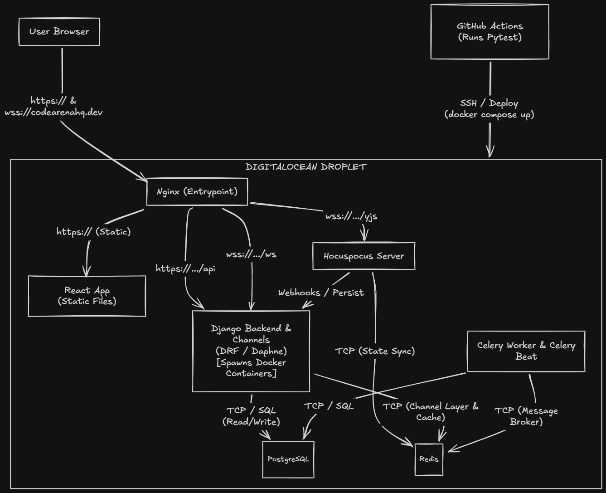

# CodeArena

## What is CodeArena
CodeArena is a collaborative coding platform designed for developers to practice algorithmic problem-solving and conduct mock interviews. It offers a comprehensive environment featuring real-time collaborative editing, an AI-powered technical interviewer, and secure, containerized code execution. Built for both solo practice and multiplayer technical interviews, CodeArena provides a seamless experience for improving coding proficiency.

## Live Demo
[Link to Live Demo]()
<video src="./demo.mp4" controls="controls" style="max-width: 100%;"></video>
### Test Credentials (Live Website Only)
You can use the following default credentials to log in and try out the live website:
- **Email:** `johndoe@test.com` | **Password:** `Testing@1234!`
- **Email:** `darthvader@test.com` | **Password:** `Testing@2@1234!`

*(Note: These credentials are for the live website deployment only, not for local development.)*

## Features
- Practice Mode: A solo environment for users to solve algorithmic challenges and run their code against test cases.
- Mock Interview Mode: A collaborative session featuring real-time code synchronization and an AI interviewer that provides hints and evaluates solutions.
- Secure Code Execution: Isolated code evaluation using Docker containers to run user submissions safely.
- Real-time Collaboration: Multi-user code editing powered by Yjs and WebSockets, ensuring low-latency synchronization.
- AI Interviewer: Integration with Google Gemini for automated code review, hinting, and interactive technical questioning.
- User Authentication: Secure login and session management powered by JWT.

## Architecture Diagram


## Tech Stack
| Layer | Technology | Why |
| --- | --- | --- |
| Frontend | React, Vite, Tailwind CSS | Fast development, component-based UI, and rapid styling. |
| Editor | Monaco Editor, Yjs | Industry-standard code editor with robust real-time collaborative editing capabilities. |
| Backend | Django, Django REST Framework | Mature Python framework for rapid API development and robust data modeling. |
| WebSockets | Django Channels, Hocuspocus | Enables real-time bidirectional communication for live collaboration and chat. |
| Task Queue | Celery, Redis | Handles asynchronous tasks and acts as a message broker for WebSockets. |
| Database | PostgreSQL | Reliable, ACID-compliant relational database for user and problem data. |
| Code Execution | Docker | Provides secure, isolated environments to safely execute untrusted user code. |
| AI Integration | Google GenAI (Gemini) | Powers the AI interviewer feature with advanced natural language understanding. |

## Getting Started / Run Locally

### Prerequisites
- Docker and Docker Compose
- Node.js (v18+)
- Python 3.10+

### Clone the Repository
```bash
git clone https://github.com/your-username/codearena.git
cd codearena
```

### Environment Setup
Create the required environment files based on the provided examples:

1. Database Environment (`db.env`):
```bash
cp db.env.example db.env
```
Fill in the PostgreSQL credentials.

2. Backend Environment (`backend.env`):
```bash
cp backend.env.example backend.env
```
Provide the required keys, including your `GEMINI_API_KEY` and `SECRET_KEY`.

3. Frontend Environment (`frontend/.env`):
```bash
cd frontend
cp .env.example .env
cd ..
```

### Run with Docker Compose
To start the entire application stack:
```bash
docker-compose up --build
```
The application will be accessible at `http://localhost:5173`.

## Environment Variables

### `db.env`
- `POSTGRES_USER`: The username for the PostgreSQL database.
- `POSTGRES_PASSWORD`: The password for the PostgreSQL database user.
- `POSTGRES_DB`: The name of the PostgreSQL database.

### `backend.env`
- `DEBUG`: Enables Django debug mode (set to False in production).
- `ALLOWED_HOSTS`: Comma-separated list of allowed hostnames.
- `FRONTEND_URL`: The URL of the frontend application for CORS.
- `SECRET_KEY`: The Django secret key used for cryptographic signing.
- `GEMINI_API_KEY`: API key for accessing Google GenAI services.
- `PORT`: The port on which the Yjs server runs.
- `REDIS_HOST`: The hostname of the Redis instance.
- `REDIS_PORT`: The port of the Redis instance.
- `DJANGO_API_URL`: The URL endpoint for the Django Yjs API.
- `DJANGO_ADMIN_PANEL`: The path for the Django admin panel.

### `frontend/.env`
- `VITE_API_URL`: The base HTTP URL for the Django backend API.
- `VITE_WS_URL`: The base WebSocket URL for Django Channels.
- `VITE_YJS_WS_URL`: The WebSocket URL for the Yjs collaborative server.

## Project Structure
```text
codearena/
├── backend/            # Django backend application
│   ├── apps/           # Django apps (auth_app, executor, interviewer, problems, rooms, yjs)
│   ├── config/         # Django project settings and configurations
│   ├── test_utils/     # Utilities for backend testing
│   └── requirements.txt# Python dependencies
├── frontend/           # React frontend application
│   ├── src/            # Source code (components, hooks, pages, store, utils)
│   ├── public/         # Static assets
│   └── package.json    # Node.js dependencies
├── yjs-server/         # Hocuspocus Node.js server for Yjs collaboration
│   └── server.js       # WebSocket server entry point
├── docker-compose.yml  # Docker Compose configuration for development
└── nginx/              # NGINX configuration for reverse proxy setup
```

## Running Tests

### Backend Tests
Navigate to the `backend` directory and run pytest:
```bash
cd backend
pytest
```

## Known Limitations / Future Work
- Code Execution Architecture: Moving code execution to Celery workers rather than processing it directly on the backend server for improved scalability and asynchronous processing.
- Enhanced Security: Utilizing Firecracker microVMs for superior isolation and security during untrusted code execution.
- Session State Persistence: Implementing a Redis cache to store submission history, preventing data loss on the frontend when a live session reloads.
- Language Support: Adding support for Java code execution alongside existing supported languages.
